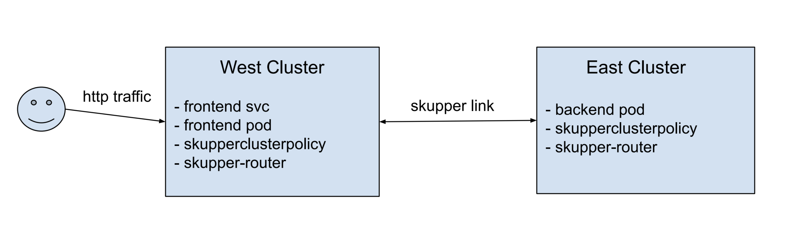

# skupper-playground

## Prerequisites

Install skupper according to the [instructions](https://skupper.io/install/index.html).

## Cluster & Skupper Site setup

Set up local kind clusters, initialise skupper & link the sites.

```bash
make local-setup
```

The skupper console is deployed to the west site.
The url is output when you run the below:

```bash
kubectl config use-context kind-skupper-cluster-1
skupper status
```

The password for the `admin` user can be retrieved from a secret:

```bash
kubectl config use-context kind-skupper-cluster-1
kubectl get secret skupper-console-users -o jsonpath="{.data.admin}" | base64 --decode
```

## Example 1: SkupperClusterPolicy

[](http://www.youtube.com/watch?v=fN3aDwOJ9wA)




Deploy the frontend and backend apps

```bash
kubectl config use-context kind-skupper-cluster-1
kubectl create deployment frontend --image quay.io/skupper/hello-world-frontend
kubectl expose deployment/frontend --port 8080 --type LoadBalancer
kubectl config use-context kind-skupper-cluster-2
kubectl create deployment backend --image quay.io/skupper/hello-world-backend --replicas 3
```

Attempt to curl the app API via the frontend app.
It should fail as the frontend cannot reach the backend service.
The error text should include something like `Name or service not known`

```bash
kubectl config use-context kind-skupper-cluster-1
curl -X POST --data '{"name":"Test","text":"Hello"}' http://$(kubectl get svc frontend -o jsonpath="{.status.loadBalancer.ingress[0].ip}"):8080/api/hello
```

Attempt to expose the backend service over the skupper network.
It should fail because of the SkupperClusterPolicy.
The error text should look like `Error: Policy validation error: deployment/backend cannot be exposed`

```bash
kubectl config use-context kind-skupper-cluster-2
skupper expose deployment/backend --port 8080
```

Update the SkupperClusterPolicy and attempt to expose the backend service again.
It should succeed this time.

```bash
kubectl config use-context kind-skupper-cluster-1
kubectl apply -f ./config/examples/skupperclusterpolicy_2.yaml
kubectl config use-context kind-skupper-cluster-2
kubectl apply -f ./config/examples/skupperclusterpolicy_2.yaml
skupper expose deployment/backend --port 8080
```

Attempt to curl the health endpoint of the frontend app again.
It should succeed this time.

```bash
kubectl config use-context kind-skupper-cluster-1
curl http://$(kubectl get svc frontend -o jsonpath="{.status.loadBalancer.ingress[0].ip}"):8080/api/health
```

## Example 2: Ingress traffic migration using Skupper as a proxy

Deploy an app with an ingress to both clusters.

```bash
kubectl config use-context kind-skupper-cluster-1
export APP_HOST=172.18.0.2.nip.io
export APP_HOST_1=$APP_HOST
envsubst < config/examples/app_with_ingress.yaml > app1.yaml
kubectl apply -f ./app1.yaml

kubectl config use-context kind-skupper-cluster-2
export APP_HOST=172.18.0.3.nip.io
export APP_HOST_2=$APP_HOST
envsubst < config/examples/app_with_ingress.yaml > app2.yaml
kubectl apply -f ./app2.yaml
```

Verify ingress connectivity to either cluster

```bash
curl $APP_HOST_1
curl $APP_HOST_2
```

Update the SkupperClusterPolicy to allow exposing services.

```bash
kubectl config use-context kind-skupper-cluster-1
kubectl apply -f ./config/examples/skupperclusterpolicy_2.yaml
kubectl config use-context kind-skupper-cluster-2
kubectl apply -f ./config/examples/skupperclusterpolicy_2.yaml
```

Expose the app service from each site

```bash
kubectl config use-context kind-skupper-cluster-1
skupper expose deployment/echo --port 8080
kubectl config use-context kind-skupper-cluster-2
skupper expose deployment/echo --port 8080
```

Scale down the app pod on the east cluster.

```bash
kubectl config use-context kind-skupper-cluster-2
kubectl scale --replicas=0 deployment/echo
```

Verify ingress connectivity to either cluster.
The service in the east cluster is routing to the service in the west cluster.

```bash
curl $APP_HOST_1
curl $APP_HOST_2
```

## Example 3: Gateway & HttpRoute traffic migration using Skupper as a proxy & OCM for placement

Deploy a Gateway to both clusters, using OCM

```bash
# Deploy both ManifestWorks to the Hub cluster
kubectl config use-context kind-skupper-cluster-1
export APP_HOST=172.18.200.2.nip.io
export APP_HOST_1=$APP_HOST
export CLUSTER_NAMESPACE=skupper-cluster-1
export APP_NAMESPACE=west
envsubst < config/examples/manifestwork_gateway.yaml > gateway1.yaml
kubectl apply -f ./gateway1.yaml

export APP_HOST=172.18.201.2.nip.io
export APP_HOST_2=$APP_HOST
export CLUSTER_NAMESPACE=skupper-cluster-2
export APP_NAMESPACE=east
envsubst < config/examples/manifestwork_gateway.yaml > gateway2.yaml
kubectl apply -f ./gateway2.yaml
```

Deploy an app with a HttpRoute to both clusters, using OCM

```bash
# Deploy both ManifestWorks to the Hub cluster
kubectl config use-context kind-skupper-cluster-1
export APP_HOST=$APP_HOST_1
export CLUSTER_NAMESPACE=skupper-cluster-1
export APP_NAMESPACE=west
envsubst < config/examples/manifestwork_app_with_httproute.yaml > app_with_httproute1.yaml
kubectl apply -f ./app_with_httproute1.yaml

export APP_HOST=$APP_HOST_2
export CLUSTER_NAMESPACE=skupper-cluster-2
export APP_NAMESPACE=east
envsubst < config/examples/manifestwork_app_with_httproute.yaml > app_with_httproute2.yaml
kubectl apply -f ./app_with_httproute2.yaml
```

Verify HttpRoute connectivity to either cluster

```bash
curl $APP_HOST_1
curl $APP_HOST_2
```

Update the SkupperClusterPolicy to allow exposing services.

```bash
kubectl config use-context kind-skupper-cluster-1
kubectl apply -f ./config/examples/skupperclusterpolicy_2.yaml
kubectl config use-context kind-skupper-cluster-2
kubectl apply -f ./config/examples/skupperclusterpolicy_2.yaml
```

Expose the app service from each site

```bash
kubectl config use-context kind-skupper-cluster-1
skupper expose deployment/echo --port 8080
kubectl config use-context kind-skupper-cluster-2
skupper expose deployment/echo --port 8080
```

Scale down the app pod on the east cluster.

```bash
kubectl config use-context kind-skupper-cluster-2
kubectl scale --replicas=0 deployment/echo
```

Verify HttpRoute connectivity to either cluster.
The service in the east cluster is routing to the service in the west cluster.

```bash
curl $APP_HOST_1
curl $APP_HOST_2
```
